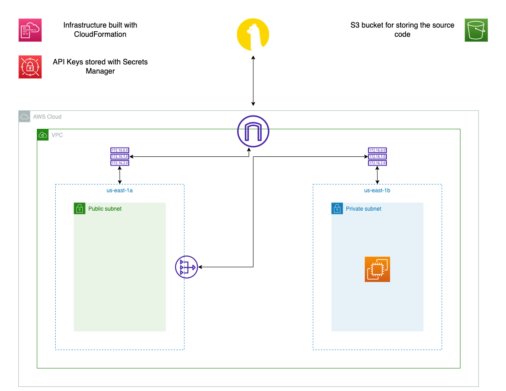

# Afk Trader
An automated trading bot built on top of the Alpaca API. Completly hosted in the AWS ecosystem with a quick and easy CloudFormation deployment.

 If you'd like to replicate this project head over to the readme.md in the cfn directory
 
 ### This is not financial advice. Only risk what you are willing to lose when participating in the stock market. The Maintainers of this repository are not responsible for your gains or losses when utilizing this bot.
 
 
 ## Architecture

Streaming Data is sourced from the Alpaca Trade markets (https://alpaca.markets/) containing information on particular stocks (In this case, Bitcoin). A python file residing on an EC2 instance continuously pulls the data via the alpaca trade api and orchestrates buy/sell orders based upon a simple RSI strategy.

## Infrastructure
The project is housed in the AWS ecosystem, packaged into two CloudFormation templates and utilizes the following resources:

**VPC:**
-   Custom built VPC with two subnets (1 private, 1 public)
-   IGW, NATGW and Route Tables

**Secrets Manager:**
-   For storing connection variables and API tokens

**S3 Bucket with versioning enabled:**
-   For storing the source code files

**t3.xlarge EC2 Instance:**
-   For running Afk Trader

# Warning:

You will incur AWS charges when you deploy this bot. Some of the most expensive things in this project are as follows:
-   t3.xlarge EC2 instance: $0.1670 / hr (On-Demand mode)
-   NATGateway: $0.045 / hr plus data processing charges

### Again, THIS IS NOT SOMETHING WHICH IS FREE TO RUN. YOU WILL INCUR CHARGES!!!
